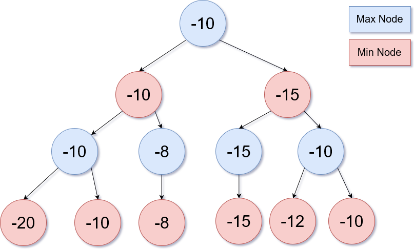
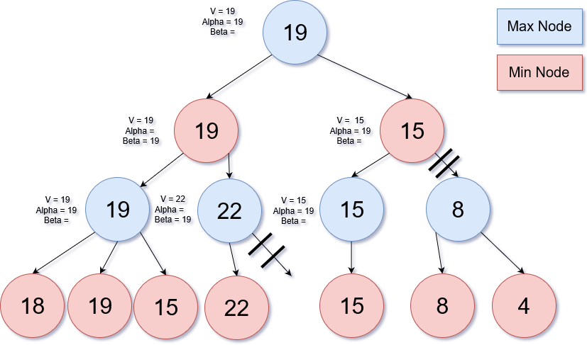

# Dependencies
Python-Chess
# Minimax
The minimax algorithm can be visualized as a tree, at the bottom of this tree we have an evaluation function determining the value of each outcome. We can specify the depth that the tree will travel to, in this example we travel to a depth of 4.
At the bottom of this tree each node has a value that we will use to evaluate which branch to take. 

    

At the top of the tree you start searching for the maximum of its child nodes. Each recursive call will change whether the node is looking for a maximum or minimum (hence the name minimax). The ai is the first call (root node) searching for the maximum node, it is assuming that the opponenent will 
pick the outcome (child node / branch) that will give it the minimum amount of points. So the ai is looking for the maximum out of the
minimumnodes.Inthediagramaboveontheleftmostnodeatajdepthof3,choosesthemaximumofthetwobelow-10.Theparentofthatnodechoosestheminimumofitschildnodes-10,therootnodechoosesthemaxofit'schildren-10.Afterthevaluesaredetermined,thealgorithmwilltakethepaththatwillgiveitthehighestvalue.

This algorithm does pick the most optimal path but the lower the depth it traverses the longer it takes to compute. This might not seem scary in a simple game like checkers or even chess (if your depth isn't that big) but when this algorithm is used on games like go, the time to compute every possible outcome takes too long for even super computers to finish in a timely manner.

# Alpha-Beta Pruning
The reason we use apha-beta pruning is because it is a way to eliminate subtrees saving time for the final evaluation to be given.
In this example, the values for alpha and beta are given for the nodes already but the algorithm will find them from top to bottom.
The Alpha in this algorithm is the maximum lower bound of all possible solution and the Beta is the minimum upper bound of all possible solutions. Alpha is initially set to -infinity and Beta is initially set to infinity. We use alpha and beta to see if we already have a
value that is higher of lower than the node we are evaluating.

    

We start at the bottom left of the tree evaluating the node with 18. The parent is a max node so it will try to find the max of its children. Since this is the first node we evaluate we set it as the current value for its parent node and we compare to see if it is greater than alpha: -infinity(This step is not shown), we then set alpha to 19. The next node is compared and we see that 19 is greater than the parent's current value. Going up the tree we are at a min node with children 19 and 22. We evaluate the subtree to the right and we find the first child of this node (node with value 22). This is where the first pruning happens. We know that this tree will pick the max and so far we have 22 but the parent above will chose the minimum of it's chidren so even if we find 100 in one of the children to the right it will not be chosen. So we prune and go to the right side of the tree. The child node to the right with depth of 2 gets value of 15 from its left child. Since the root node is a max node it will choose whichever node will be greatest of it's two children  but the node we are currently on (node on right side of root, depth of 2) will choose the minimum so we will only be able to get a 15 or lower from any of the right children of this node so we do not evaluate the right side of this node.

For a more thorough explanation of Alpha-Beta Pruning read http://web.cs.ucla.edu/~rosen/161/notes/alphabeta.html
